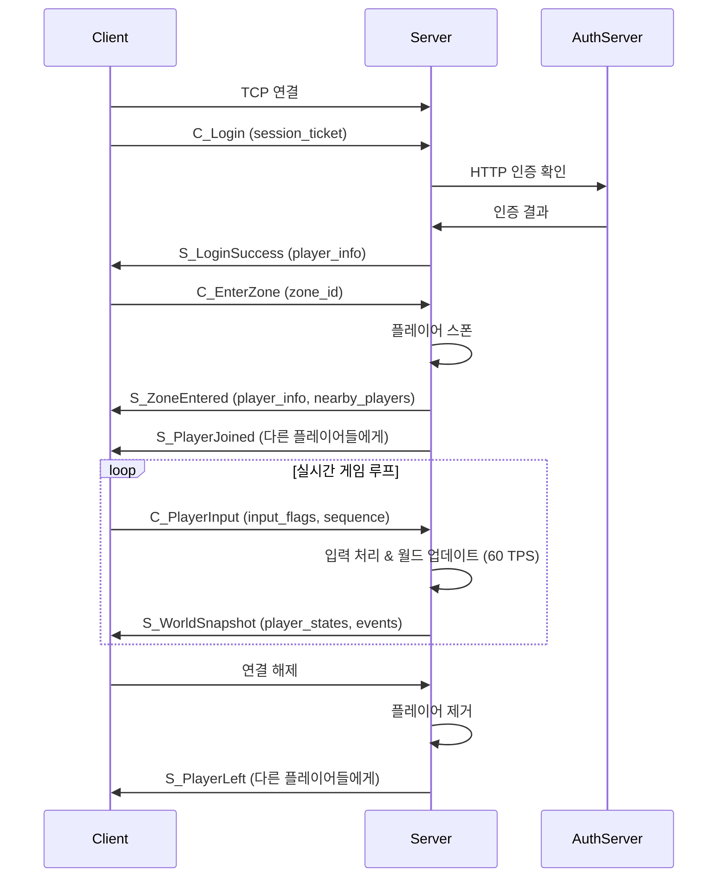

# CppMMO Server Documentation

## 📋 목차
1. [서버 개요](#서버-개요)
2. [네트워크 아키텍처](#네트워크-아키텍처)
3. [패킷 프로토콜](#패킷-프로토콜)
4. [게임 플로우](#게임-플로우)
5. [서버 설정](#서버-설정)
6. [클라이언트 개발 가이드](#클라이언트-개발-가이드)

---

## 서버 개요

### 🎯 **서버 특징**
- **아키텍처**: Server Authority (서버 권한) 방식
- **네트워크**: TCP 기반 FlatBuffers 패킷 통신
- **게임 루프**: 60 TPS (Tick Per Second)
- **공간 최적화**: QuadTree AOI (Area of Interest) 시스템
- **멀티플레이어**: 실시간 동기화 지원

### 🔧 **기술 스택**
- **언어**: C++17
- **네트워킹**: Boost.Asio (TCP)
- **직렬화**: FlatBuffers
- **데이터베이스**: MySQL 8.0
- **캐시**: Redis (채팅 시스템)
- **로깅**: spdlog
- **컨테이너**: Docker Compose

---

## 네트워크 아키텍처

### 🌐 **서버 구성**
```
┌─────────────────┐    ┌─────────────────┐
│   Unity Client  │────│  CppMMO Server  │
│                 │    │    (Port 8080)  │
└─────────────────┘    └─────────────────┘
                               │
                    ┌──────────┼──────────┐
                    │          │          │
            ┌───────────┐ ┌─────────┐ ┌─────────┐
            │AuthServer │ │  Redis  │ │  MySQL  │
            │(Port 5278)│ │(Port 6379)│(Port 3306)│
            └───────────┘ └─────────┘ └─────────┘
```

### 📡 **연결 정보**
- **CppMMO Server**: `localhost:8080` (TCP)
- **AuthServer**: `localhost:5278` (HTTP)
- **Redis**: `localhost:6379`
- **MySQL**: `localhost:3307`

---

## 패킷 프로토콜

### 📦 **패킷 구조**
모든 패킷은 FlatBuffers `UnifiedPacket` 형태로 전송됩니다:

```cpp
table UnifiedPacket {
    id: PacketId;
    data: PacketData;
}
```

### 🔢 **패킷 ID 목록**

#### **클라이언트 → 서버**
- `C_Login (1)`: 로그인 요청
- `C_Chat (4)`: 채팅 메시지
- `C_PlayerInput (10)`: 플레이어 입력
- `C_EnterZone (20)`: 존 입장 요청

#### **서버 → 클라이언트**
- `S_LoginSuccess (2)`: 로그인 성공
- `S_LoginFailure (3)`: 로그인 실패
- `S_Chat (5)`: 채팅 메시지
- `S_WorldSnapshot (11)`: 월드 스냅샷
- `S_StateCorrection (12)`: 상태 보정
- `S_GameTick (13)`: 게임 틱
- `S_ZoneEntered (21)`: 존 입장 성공
- `S_PlayerJoined (22)`: 플레이어 입장 알림
- `S_PlayerLeft (23)`: 플레이어 퇴장 알림

### 📋 **주요 패킷 상세**

#### **1. C_Login**
```fbs
table C_Login {
    session_ticket: string;
}
```

#### **2. S_LoginSuccess**
```fbs
table S_LoginSuccess {
    player_info: PlayerInfo;
}

table PlayerInfo {
    player_id: uint64;
    name: string;
    position: Vec3;
    hp: int;
    max_hp: int;
}
```

#### **3. C_PlayerInput**
```fbs
table C_PlayerInput {
    input_flags: uint8;      // WASD 비트마스크
    sequence_number: uint32;
}
```

#### **4. S_WorldSnapshot**
```fbs
table S_WorldSnapshot {
    tick_number: uint64;
    server_time: uint64;
    player_states: [PlayerState];
    events: [GameEvent];
}

table PlayerState {
    player_id: uint64;
    position: Vec3;
    velocity: Vec3;
    is_active: bool;
}
```

#### **5. C_EnterZone**
```fbs
table C_EnterZone {
    zone_id: int;
}
```

#### **6. S_ZoneEntered**
```fbs
table S_ZoneEntered {
    zone_id: int;
    player_info: PlayerInfo;
    nearby_players: [PlayerInfo];
}
```

### 🎮 **입력 플래그 (Input Flags)**
```cpp
enum InputFlags : uint8 {
    None = 0,
    W = 1,      // 0000 0001 = W (Up)
    S = 2,      // 0000 0010 = S (Down)
    A = 4,      // 0000 0100 = A (Left)
    D = 8,      // 0000 1000 = D (Right)
    Shift = 16, // 0001 0000 = Sprint
    Space = 32  // 0010 0000 = Jump
}
```

---

## 게임 플로우

### 🔄 **전체 게임 플로우**



### 📝 **단계별 상세 설명**

#### **1. 연결 및 인증**
1. 클라이언트가 `localhost:8080`에 TCP 연결
2. `C_Login` 패킷으로 session_ticket 전송
3. 서버가 AuthServer로 인증 확인
4. 인증 성공 시 `S_LoginSuccess` 응답

#### **2. 존 입장**
1. `C_EnterZone` 패킷으로 존 입장 요청
2. 서버가 랜덤 스폰 위치 생성 (맵 중앙 근처)
3. `S_ZoneEntered` 응답 (본인 정보 + 근처 플레이어들)
4. 다른 플레이어들에게 `S_PlayerJoined` 브로드캐스트

#### **3. 실시간 게임 루프**
1. 클라이언트가 `C_PlayerInput` 전송 (WASD 입력)
2. 서버가 60 TPS로 월드 업데이트
3. 서버가 20Hz로 `S_WorldSnapshot` 전송
4. 플레이어 위치, 속도 정보 동기화

#### **4. 연결 해제**
1. 클라이언트 연결 종료
2. 서버가 플레이어 비활성화
3. 다른 플레이어들에게 `S_PlayerLeft` 브로드캐스트

---

## 서버 설정

### ⚙️ **게임 설정** (`config/game_config.json`)
```json
{
    "map": {
        "width": 200.0,
        "height": 200.0
    },
    "gameplay": {
        "chat_range": 50.0,
        "aoi_range": 100.0,
        "move_speed": 5.0,
        "tick_rate": 60
    },
    "network": {
        "snapshot_rate": 20,
        "reconnect_timeout_minutes": 5
    }
}
```

### 🎯 **주요 설정 값**
- **맵 크기**: 200x200
- **이동 속도**: 5.0 유닛/초
- **AOI 범위**: 100 유닛 (다른 플레이어 감지 범위)
- **채팅 범위**: 50 유닛
- **게임 틱**: 60 TPS
- **스냅샷 전송**: 20Hz
- **재연결 타임아웃**: 5분

---

## 클라이언트 개발 가이드

### 🛠️ **Unity 클라이언트 개발 단계**

#### **Phase 1: 기본 연결 (1-2일)**
```csharp
// 1. TCP 연결
TcpClient client = new TcpClient();
client.Connect("localhost", 8080);

// 2. FlatBuffers 패키지 설치
// Package Manager에서 FlatBuffers 설치

// 3. 기본 패킷 송수신
// UnifiedPacket 생성 및 전송
```

#### **Phase 2: 인증 시스템 (1일)**
```csharp
// 1. 로그인 패킷 생성
var builder = new FlatBufferBuilder(1024);
var sessionTicket = builder.CreateString("your_session_ticket");
var login = C_Login.CreateC_Login(builder, sessionTicket);
var packet = UnifiedPacket.CreateUnifiedPacket(builder, 
    PacketId.C_Login, Packet.C_Login, login.Union());

// 2. 패킷 전송
byte[] data = builder.SizedByteArray();
networkStream.Write(data, 0, data.Length);
```

#### **Phase 3: 플레이어 시스템 (2-3일)**
```csharp
// 1. 플레이어 스폰
public class Player : MonoBehaviour {
    public uint64 playerId;
    public Vector3 position;
    public Vector3 velocity;
    public bool isActive;
}

// 2. 존 입장
void EnterZone() {
    var builder = new FlatBufferBuilder(1024);
    var enterZone = C_EnterZone.CreateC_EnterZone(builder, 1);
    // 패킷 전송...
}
```

#### **Phase 4: 입력 및 이동 (2-3일)**
```csharp
// 1. 입력 처리
uint8 inputFlags = 0;
if (Input.GetKey(KeyCode.W)) inputFlags |= InputFlags.W;
if (Input.GetKey(KeyCode.S)) inputFlags |= InputFlags.S;
if (Input.GetKey(KeyCode.A)) inputFlags |= InputFlags.A;
if (Input.GetKey(KeyCode.D)) inputFlags |= InputFlags.D;

// 2. 입력 패킷 전송
void SendPlayerInput(uint8 inputFlags, uint32 sequence) {
    var builder = new FlatBufferBuilder(1024);
    var playerInput = C_PlayerInput.CreateC_PlayerInput(builder, inputFlags, sequence);
    // 패킷 전송...
}
```

#### **Phase 5: 월드 동기화 (3-4일)**
```csharp
// 1. 월드 스냅샷 처리
void ProcessWorldSnapshot(S_WorldSnapshot snapshot) {
    for (int i = 0; i < snapshot.PlayerStatesLength; i++) {
        var playerState = snapshot.PlayerStates(i);
        UpdatePlayer(playerState.PlayerId, playerState.Position, playerState.Velocity);
    }
}

// 2. 플레이어 보간
void UpdatePlayer(uint64 playerId, Vec3 position, Vec3 velocity) {
    var player = GetPlayer(playerId);
    player.transform.position = Vector3.Lerp(player.transform.position, 
        new Vector3(position.X, position.Y, position.Z), Time.deltaTime * 10f);
}
```

### 📊 **성능 최적화 팁**

#### **1. 네트워크 최적화**
- 입력 패킷을 매 프레임 전송하지 말고 변경된 경우만 전송
- 시퀀스 번호로 중복 패킷 방지
- 압축 및 배칭 고려

#### **2. 렌더링 최적화**
- 플레이어 보간 (Lerp) 사용
- AOI 범위 밖 플레이어 컬링
- 오브젝트 풀링 사용

#### **3. 메모리 최적화**
- FlatBuffers 재사용
- 불필요한 객체 생성 방지

### 🔧 **개발 도구**

#### **1. 패킷 디버깅**
```csharp
// 패킷 로그 출력
Debug.Log($"Sent: {PacketId.C_PlayerInput}, Flags: {inputFlags}, Seq: {sequence}");
Debug.Log($"Received: {PacketId.S_WorldSnapshot}, Players: {snapshot.PlayerStatesLength}");
```

#### **2. 서버 로그 모니터링**
```bash
# 실시간 서버 로그 확인
docker-compose logs -f cppmmo_server

# 특정 플레이어 로그 필터링
docker-compose logs cppmmo_server | grep "Player 12345"
```

#### **3. 네트워크 테스트**
```bash
# 서버 연결 테스트
telnet localhost 8080

# 포트 확인
netstat -an | grep :8080
```

---

## 🎯 **다음 단계**

1. **Unity 프로젝트 생성**
2. **FlatBuffers Unity 패키지 설치**
3. **기본 네트워크 클라이언트 구현**
4. **패킷 송수신 시스템 구축**
5. **플레이어 이동 및 동기화 구현**
6. **UI 및 게임 완성도 향상**

---

## 📞 **문의 사항**

서버 구현에 대한 추가 문의나 클라이언트 개발 중 문제가 발생하면 언제든지 문의하세요!

**서버 상태 확인**: `docker-compose ps`
**서버 로그 확인**: `docker-compose logs -f cppmmo_server`
**서버 재시작**: `docker-compose restart cppmmo_server`

---

*최종 업데이트: 2025-01-18*
*CppMMO Server Version: 1.0*